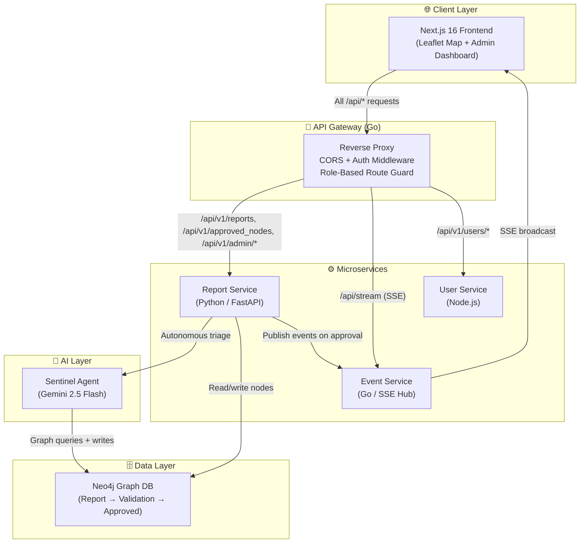
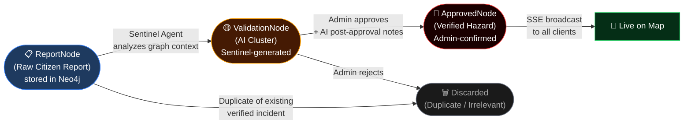
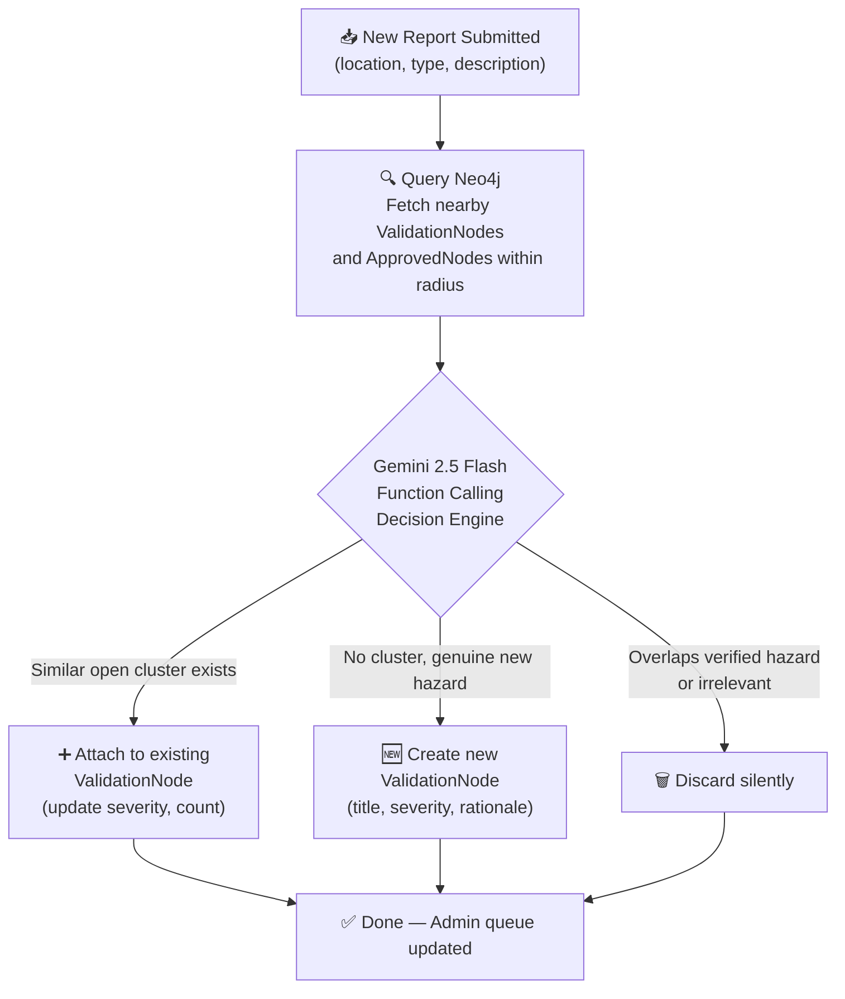
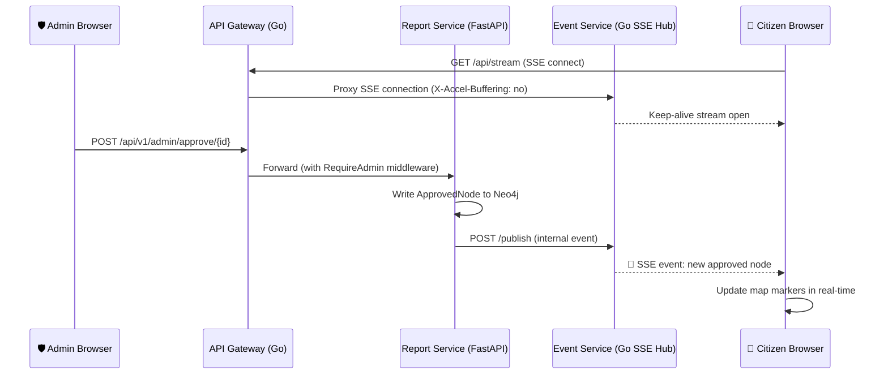
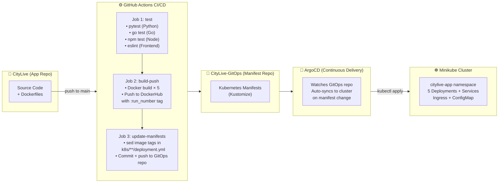

<div align="center">

# CityLive

### *Real-Time Urban Hazard Intelligence Platform*

A full-stack, production-grade platform where citizens report city hazards, an autonomous **Sentinel AI Agent** triages and clusters them using graph intelligence, and verified incidents are broadcast **live** to everyone on an interactive map.

<br/>


</div>

---

## 📌 Table of Contents

- [What is CityLive?](#-what-is-citylive)
- [Screenshots](#-screenshots)
- [System Architecture](#-system-architecture)
- [The Three-Tier Node Hierarchy](#-the-three-tier-node-hierarchy)
- [Service Breakdown](#-service-breakdown)
- [Sentinel AI Agent](#-sentinel-ai-agent)
- [Real-Time Event Pipeline](#-real-time-event-pipeline)
- [DevOps & GitOps Pipeline](#-devops--gitops-pipeline)
- [Kubernetes Infrastructure](#-kubernetes-infrastructure)
- [Repository Structure](#-repository-structure)
- [Docker Images](#-docker-images)
- [Future Enhancements](#-future-enhancements)

---

## 🌆 What is CityLive?

CityLive is a **production-grade, microservices-based urban intelligence platform** built to give city residents real-time visibility into active hazards in their area.

**The core loop:**

1. 📍 A **citizen** spots a hazard (flooding, gas leak, accident, etc.) and submits a georeferenced report via the map UI
2. 🤖 The **Sentinel AI Agent** (powered by Gemini 2.5 Flash) autonomously analyzes the report against the city's existing knowledge graph in Neo4j — clustering it into an existing incident, creating a new one, or discarding it as a duplicate
3. 🛡️ An **Admin** reviews AI-detected clusters in the Command Center and approves or rejects them with full context
4. 🔴 Approved incidents appear **live** on every connected user's map via a Server-Sent Events stream — no page refresh needed

The platform is engineered with a **polyglot microservices architecture**, a full **GitOps CI/CD pipeline** (GitHub Actions → ArgoCD), and deployed on **Kubernetes**.

---

## 📸 Screenshots

### Citizen Map View
> The interactive real-time hazard map. Red markers = Admin-verified. Amber markers = AI-detected, pending review.


### Admin Command Center
> Admins review AI-clustered validation nodes, inspect source reports, and approve or reject with one click.


---

## 🏗️ System Architecture



---

## 🔄 The Three-Tier Node Hierarchy

The heart of CityLive is a **graph-native, three-tier incident lifecycle** stored in Neo4j.



| Node Type | Color | Created By | Purpose |
|---|---|---|---|
| `ReportNode` | Blue | Citizen submission | Raw georeferenced report with description |
| `ValidationNode` | 🟡 Amber | Sentinel AI Agent | Clustered incident with AI rationale & severity |
| `ApprovedNode` | 🔴 Red | Admin | Verified, public hazard with AI post-approval notes |

---

## 🧩 Service Breakdown

| Service | Language / Framework | DockerHub Image | Responsibility |
|---|---|---|---|
| **api-gateway** | Go 1.23 | [`sudh1804/citylive-api-gateway`](https://hub.docker.com/r/sudh1804/citylive-api-gateway) | Single entry point. Reverse proxy with CORS and role-based JWT middleware (`X-User-Role` header). Guards admin routes. |
| **report-service** | Python 3.11 / FastAPI | [`sudh1804/citylive-report-service`](https://hub.docker.com/r/sudh1804/citylive-report-service) | Core domain service. Manages Neo4j graph lifecycle, hosts the Sentinel Agent, exposes REST endpoints for reports, approved/validation nodes, and AI insights. |
| **event-service** | Go 1.23 | [`sudh1804/citylive-event-service`](https://hub.docker.com/r/sudh1804/citylive-event-service) | Lightweight SSE hub. Receives internal publish calls from the report-service on node approval and fans out live events to all connected browser clients. |
| **user-service** | Node.js 20 / Express | [`sudh1804/citylive-user-service`](https://hub.docker.com/r/sudh1804/citylive-user-service) | Trust Engine. Handles user registration, authentication, and role assignment. |
| **frontend** | Next.js 16 / React 19 | [`sudh1804/citylive-frontend`](https://hub.docker.com/r/sudh1804/citylive-frontend) | Citizen map view (Leaflet), report submission modal with geolocation, live SSE feed hook, and admin command center with resizable panels. |

---

## 🤖 Sentinel AI Agent

The **Sentinel Agent** is an autonomous agentic workflow embedded in the `report-service`. It runs every time a new citizen report is submitted.



**Key capabilities:**
- 🗺️ **Graph-aware reasoning** — Gemini receives real Neo4j context (nearby nodes, their reports, severities) as tool call responses, not just raw text
- 🧠 **Cluster intelligence** — Intelligently merges citizen reports into coherent, actionable incidents rather than creating noise
- 📝 **Post-approval enrichment** — When an admin approves a node, the Agent generates `ai_post_approval_notes` summarizing the verified incident for public display
- 🔢 **Severity scoring** — Each ValidationNode gets a `1-10` severity score used for map marker sizing and feed ordering

**Tech:** `google-genai >= 1.0.0`, `neo4j` Python driver, `FastAPI` lifespan-managed DB connections

---

## ⚡ Real-Time Event Pipeline

CityLive delivers live updates without polling, using a clean **publish/subscribe SSE architecture**.



- The API Gateway disables response buffering (`X-Accel-Buffering: no`) specifically for the `/api/stream` route to ensure SSE frames are flushed immediately
- The `useLiveNodes` React hook manages the SSE connection and merges incoming events into the component state seamlessly

---

## 🔄 DevOps & GitOps Pipeline

CityLive uses a fully automated **GitOps delivery model** across two repositories.



### Pipeline Jobs Detail

| Job | Trigger | Steps |
|---|---|---|
| **test** | Every push to `main` | Run pytest, go test, npm test, ESLint in sequence |
| **build-push** | After `test` passes | Build 5 Docker images, push with `:run_number` + `:latest` to DockerHub |
| **update-manifests** | After `build-push` | Checkout GitOps repo, `sed` image tags, commit `[skip ci]` and push |

> **GitOps Principle:** The application repo (`CityLive`) never touches the cluster directly. All deployments flow through the `CityLive-GitOps` manifest repo, with ArgoCD as the single source of truth.

---

## ☸️ Kubernetes Infrastructure

All services run in the `citylive-app` namespace, managed with **Kustomize** and watched by **ArgoCD**.

```
citylive-app namespace
├── Deployments (×5)        api-gateway, report-service, event-service, user-service, frontend
├── Services (×5)           ClusterIP for each deployment
├── Ingress                 citylive.dev → frontend (/), api-gateway (/api)
├── ConfigMap               Non-sensitive env vars (service URLs, ports, env flags)
└── Secrets                 Neo4j credentials, Gemini API key, JWT secrets
```

### Ingress Routing

| Path | Backend Service | Port |
|---|---|---|
| `/` | `frontend` | 80 |
| `/api/*` | `api-gateway` | 80 |

### API Gateway Route Map

| Route | Guard | Proxied To |
|---|---|---|
| `POST /api/v1/reports` | Public | report-service |
| `GET /api/v1/approved_nodes` | Public | report-service |
| `GET /api/v1/ai-insights` | Public | report-service |
| `GET /api/v1/validation_nodes` | `RequireAdmin` | report-service |
| `GET /api/v1/validation/{id}` | `RequireAdmin` | report-service |
| `POST /api/v1/admin/{action}/{id}` | `RequireAdmin` | report-service |
| `GET /api/stream` | Public (SSE) | event-service |
| `* /api/v1/users/*` | Public | user-service |

---

## 📁 Repository Structure

```
CityLive/                           ← Main application repository
├── .github/
│   └── workflows/
│       └── ci.yml                  ← GitHub Actions pipeline (3 jobs)
│
├── frontend/                       ← Next.js 16 app
│   ├── src/
│   │   ├── app/
│   │   │   ├── page.tsx            ← Citizen map view
│   │   │   └── admin/page.tsx      ← Admin Command Center
│   │   ├── components/
│   │   │   ├── LeafletMap.tsx      ← Interactive map with dual-tier markers
│   │   │   ├── ReportModal.tsx     ← Hazard submission form with geolocation
│   │   │   ├── PulseFeed.tsx       ← Live hazard feed panel
│   │   │   └── UserSwitcher.tsx    ← Dev-mode role switcher
│   │   ├── hooks/
│   │   │   └── useLiveNodes.ts     ← SSE connection + state management
│   │   ├── services/
│   │   │   └── api.ts              ← API client (relative paths)
│   │   └── types/index.ts          ← ReportNode, ValidationNode, ApprovedNode types
│   └── Dockerfile                  ← Multi-stage Node 20 → nginx build
│
├── services/
│   ├── api-gateway/                ← Go reverse proxy
│   │   └── internal/
│   │       ├── proxy/router.go     ← Route registration + CORS wrapper
│   │       ├── middleware/         ← RequireAdmin JWT middleware
│   │       └── config/             ← Env-based service URL config
│   │
│   ├── report-service/             ← Python/FastAPI core service
│   │   ├── api/routes.py           ← REST endpoints
│   │   ├── services/
│   │   │   ├── ai_service.py       ← Sentinel Agent (Gemini function calling)
│   │   │   └── report_service.py   ← Business logic + Neo4j operations
│   │   ├── infrastructure/
│   │   │   └── database.py         ← Neo4j driver lifecycle
│   │   └── app.py                  ← FastAPI app with lifespan handler
│   │
│   ├── event-service/              ← Go SSE hub
│   │   └── internal/               ← SSE broker + HTTP handlers
│   │
│   └── user-service/               ← Node.js trust engine
│       └── src/                    ← Express app, auth routes
│
├── infra/
│   ├── docker-compose.yml          ← Jenkins + SonarQube + PostgreSQL stack
│   └── jenkins/                    ← Custom Jenkins Dockerfile
│
├── scripts/                        ← Utility scripts
├── Jenkinsfile                     ← Legacy Jenkins pipeline
└── assets/                         ← README screenshots

CityLive-GitOps/                    ← Separate GitOps manifest repository
└── k8s/
    ├── kustomization.yaml          ← Kustomize resource list
    ├── configMap.yml               ← Non-sensitive environment config
    ├── ingress.yml                 ← Nginx ingress rules
    ├── api-gateway/                ← deployment.yml + service.yml
    ├── report-service/
    ├── event-service/
    ├── user-service/
    └── frontend/
```

---

## 🐳 Docker Images

All images are published to DockerHub on every successful CI run, tagged with both the build number and `:latest`.

| Service | Image | DockerHub |
|---|---|---|
| API Gateway | `sudh1804/citylive-api-gateway` | [](https://hub.docker.com/r/sudh1804/citylive-api-gateway) |
| Report Service | `sudh1804/citylive-report-service` | [](https://hub.docker.com/r/sudh1804/citylive-report-service) |
| Event Service | `sudh1804/citylive-event-service` | [](https://hub.docker.com/r/sudh1804/citylive-event-service) |
| User Service | `sudh1804/citylive-user-service` | [](https://hub.docker.com/r/sudh1804/citylive-user-service) |
| Frontend | `sudh1804/citylive-frontend` | [](https://hub.docker.com/r/sudh1804/citylive-frontend) |

---

## 🔮 Future Enhancements

### 🔐 Authentication & Security
- Full JWT implementation · OAuth2 / Social Login · Rate limiting · Report credibility scoring

### 🤖 AI & Intelligence
- Multimodal reports (photo evidence) · Predictive hazard forecasting · Auto-resolution · Sentiment & urgency detection

### 🗺️ Map & UX
- Mobile app · Push notifications · Heatmap layer · Hazard filtering · Report status tracking

### ⚙️ Infrastructure & DevOps
- Horizontal Pod Autoscaling · Observability stack (Prometheus + Grafana) · Distributed tracing · SonarQube re-enablement · Helm charts · Database backups · Secrets management (Vault)

### 📊 Admin & Analytics
- Analytics dashboard · Bulk actions · Admin audit log · Notification routing to city departments

---

<div align="center">

**Built with ❤️ by [Sudhanshu](https://github.com/Sudhanshu-NITR)**

*CityLive — Because every city deserves a nervous system.*

</div>
